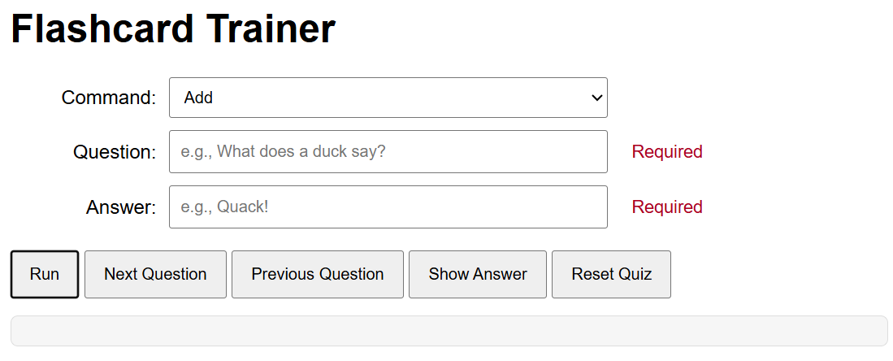
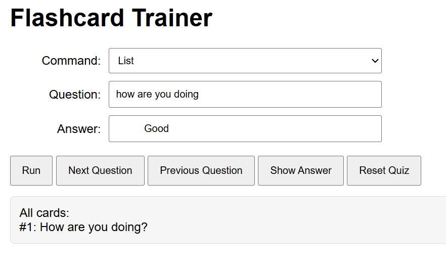
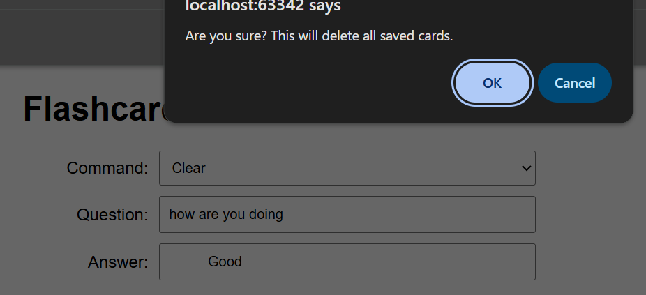
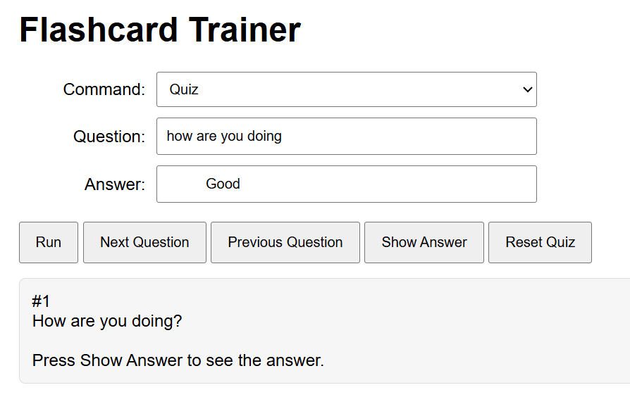

# Flashcard Quiz Application

## Overview

This program is a JavaScript-based flashcard application designed to make creating and studying flashcards quick and easy. Users can add custom flashcards, list existing cards, 
and quiz themselves using an interactive interface. The quiz mode allows users to navigate forward and backward through cards, reveal answers on demand, and reset the quiz at any time.

The application also includes built-in error handling to ensure users provide valid input when creating flashcards.

---

## Features

- Add flashcards with a question and answer
- Automatically formats questions and answers
- List all stored flashcards
- Interactive quiz mode
  - Next and previous card navigation
  - Show/hide answers
  - Reset quiz to the beginning
- Load default flashcards and provides a confirm to verify the user want's to delete all current cards
- Clear all flashcards with confirmation and provides a confirm to verify the user want's to delete all current cards
- User-friendly error handling

---

## How It Works

The program stores flashcards using two arrays:
- One for questions
- One for answers

A command-based system determines which action to perform (`add`, `list`, `quiz`, `clear`, `load_default`) using a `switch` statement. During quiz mode, the program tracks the current card index and whether the answer should be displayed.

DOM manipulation is used extensively to update the UI based on user interaction.

---

## Commands

| Command        | Description |
|----------------|-------------|
| `add`          | Adds a new flashcard using the provided question and answer |
| `list`         | Displays all saved flashcard questions |
| `quiz`         | Starts or continues quiz mode |
| `clear`        | Clears all flashcards (with confirmation) |
| `load_default` | Loads a preset group of flashcards |

---

## Screenshots
- add a new card

- Can't add a blank card

- list existing cards

- clear out for new set

- load default for testing

- quiz yourself

---

## Technologies Used

- JavaScript
- HTML
- CSS
- DOM Manipulation

---

## Version
**Date:** 2/6/2026

---

## Developer

**Ethan McEvoy**

- GitHub Profile: https://github.com/EMcE01
---

## License
This project is for educational purposes.
