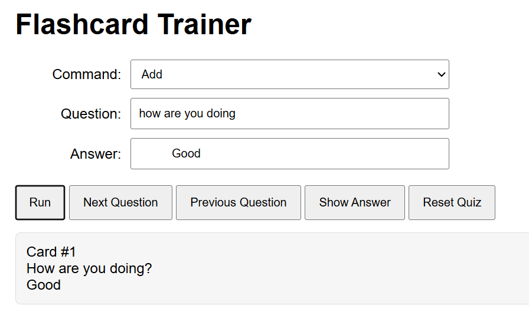
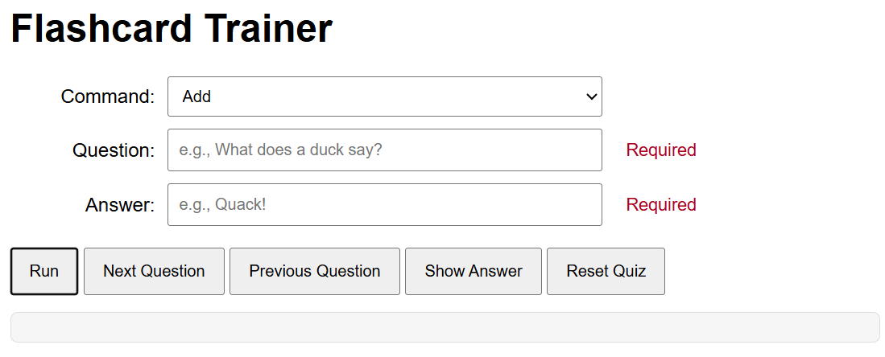
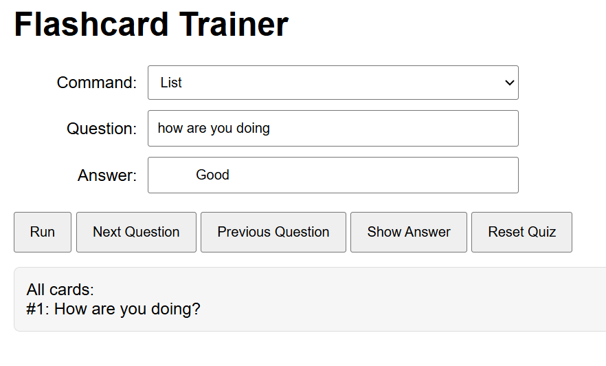
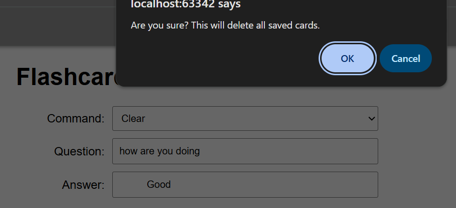
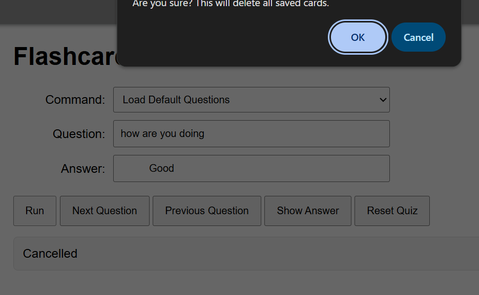
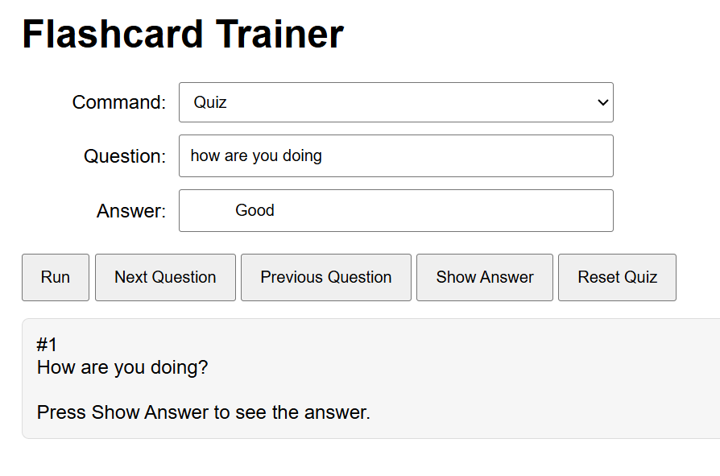

# 🧮 Flashcard Quiz Application CHs 3/4

### 👤 Author
- Ethan McEvoy (https://github.com/EMcE01)

---

## 📚 Table of Contents
- [📖 Project Overview](#-project-overview--summary)
- [🧰 Tech Stack](#-tech-stack)
- [🛠 Development Tools](#-development-tools)
- [💡 Core Concepts](#-core-concept--new-concepts)
- [✨ Features](#-features)
- [🖼 Visual Aids](#-visual-aids-screenshots--gifs--reports--data-input--output)
- [🧠 Reflection](#-reflection-what-i-learned)

---

## 📖 Project Overview / Summary
> 🔝 [Back to TOC](#-table-of-contents)

This program is a JavaScript-based flashcard application designed to make creating and studying flashcards quick and easy. Users can add custom flashcards, list existing cards, 
and quiz themselves using an interactive interface. The quiz mode allows users to navigate forward and backward through cards, reveal answers on demand, and reset the quiz at any time.

The application also includes built-in error handling to ensure users provide valid input when creating flashcards.

## How It Works

The program stores flashcards using two arrays:
- One for questions
- One for answers

A command-based system determines which action to perform (`add`, `list`, `quiz`, `clear`, `load_default`) using a `switch` statement. During quiz mode, the program tracks the current card index and whether the answer should be displayed.

DOM manipulation is used extensively to update the UI based on user interaction.

---

## Commands

| Command        | Description |
|----------------|-------------|
| `add`          | Adds a new flashcard using the provided question and answer |
| `list`         | Displays all saved flashcard questions |
| `quiz`         | Starts or continues quiz mode |
| `clear`        | Clears all flashcards (with confirmation) |
| `load_default` | Loads a preset group of flashcards |

---

## 🧰 Tech Stack
> 🔝 [Back to TOC](#-table-of-contents)

| Category       | Technology Used |
|----------------|----------------|
| Frontend       | HTML, CSS|
| Backend        | JavaScript|

---

## 🛠 Development Tools
> 🔝 [Back to TOC](#-table-of-contents)

| Tool | Purpose |
|------|--------|
| WebStorm | Primary Code editor |
| VS Code | Code editor |
| GitHub | Version control |
| Chrome DevTools | Debugging |

---

## 💡 Core Concept / New Concepts
> 🔝 [Back to TOC](#-table-of-contents)

- 📌 data validation – not allowing for blank questions or answers
- 📌 adding buttons – provides enough buttons to perform each task
- 📌 confirm – pop-up to confirm from user that all cards will be deleted
  
---

## ✨ Features
> 🔝 [Back to TOC](#-table-of-contents)

- Add flashcards with a question and answer
- Automatically formats questions and answers
- List all stored flashcards
- Interactive quiz mode
  - Next and previous card navigation
  - Show/hide answers
  - Reset quiz to the beginning
- Load default flashcards and provides a confirm to verify the user want's to delete all current cards
- Clear all flashcards with confirmation and provides a confirm to verify the user want's to delete all current cards
- User-friendly error handling

---

## 🖼 Visual Aids: Screenshots / GIFs / Reports / Data Input & Output
> 🔝 [Back to TOC](#-table-of-contents)

- add a new card

- Can't add a blank card

- list existing cards

- clear out for new set

- load default for testing

- quiz yourself

---

## 🧠 Reflection: 
> 🔝 [Back to TOC](#-table-of-contents)

I went above and beyond this assignment's requirements. I wanted to make something that students of all majors could use. I played around with the ability to add pictures to both the questions and answers as some majors require visual representations to grasp the question. I added several buttons I was not asked for as I felt that simply having one button that did everything made it not as user friendly. My biggest issue I ran into was making the buttons a submit rather than just buttons. This caused the order of the questions start to get shuffled. 
